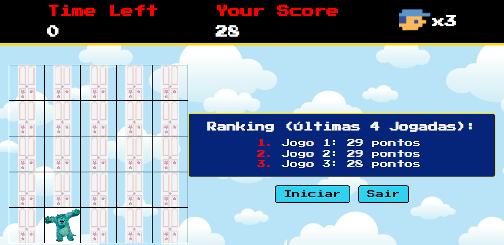

# Dio - Desafio de Projeto - Encontre o Sully

## Projeto desenvolvido com base no projeto "Detona Ralph" ministrado em aula

## Tecnologias Utilizadas
- HTML
- CSS
- JavaScript

# Como Jogar
1. Clique no botão "Iniciar" para começar.
2. clique nos quadrados com o inimigo antes que o tempo acabe.
3. Veja sua pontuação no ranking ao final do jogo.

## Funcionalidades
- Sistema de contagem de tempo
- Pontuação baseada nos cliques corretos.
- Ranking com as últimas pontuações.

## Projeto funcionando
Veja abaixo como o jogo funciona:

### Autor
Ana Paula de Almeida Coiado